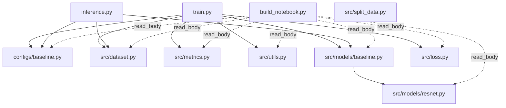

# Python Reference Map

This map covers all Python files found in the workspace and how they are referenced.

## 1) Dependency Graph (local modules only)

- Solid arrow: imported (`from ... import ...`)
- Dotted arrow: file body is read as text and embedded into generated notebook (`read_body(...)`)

## 2) File-by-file Reference Table

| File | Referenced by | How |
|---|---|---|
| `configs/baseline.py` | `train.py`, `inference.py`, `build_notebook.py` | import (`*`), source embedding (`read_body`) |
| `src/dataset.py` | `train.py`, `inference.py`, `build_notebook.py` | import (`VQADataset`), source embedding |
| `src/metrics.py` | `train.py`, `build_notebook.py` | import (`VQA_criterion`), source embedding |
| `src/utils.py` | `train.py`, `build_notebook.py` | import (`set_seed`), source embedding |
| `src/models/baseline.py` | `train.py`, `inference.py`, `build_notebook.py` | import (`VQAModel`), source embedding |
| `src/models/resnet.py` | `src/models/baseline.py`, `build_notebook.py` | relative import (`from .resnet ...`), source embedding |
| `src/loss.py` | `train.py`, `build_notebook.py` | import (`SoftCrossEntropyLoss`, `build_soft_target`), source embedding |
| `train.py` | (none in repo) | executable entry script |
| `inference.py` | (none in repo) | executable entry script |
| `build_notebook.py` | (none in repo) | executable utility script |
| `src/split_data.py` | (none in repo) | one-off data preprocessing script |

## 3) Primary Runtime Flows

1. Training flow
   - `train.py` -> `configs/baseline.py`
   - `train.py` -> `src/dataset.py`
   - `train.py` -> `src/models/baseline.py` -> `src/models/resnet.py`
   - `train.py` -> `src/metrics.py`
   - `train.py` -> `src/loss.py`
   - `train.py` -> `src/utils.py`

2. Inference flow
   - `inference.py` -> `configs/baseline.py`
   - `inference.py` -> `src/dataset.py`
   - `inference.py` -> `src/models/baseline.py` -> `src/models/resnet.py`

3. Notebook build flow
   - `build_notebook.py` reads and embeds source from:
     - `configs/baseline.py`
     - `src/utils.py`
     - `src/dataset.py`
     - `src/metrics.py`
     - `src/models/resnet.py`
     - `src/models/baseline.py`
     - `src/loss.py`
